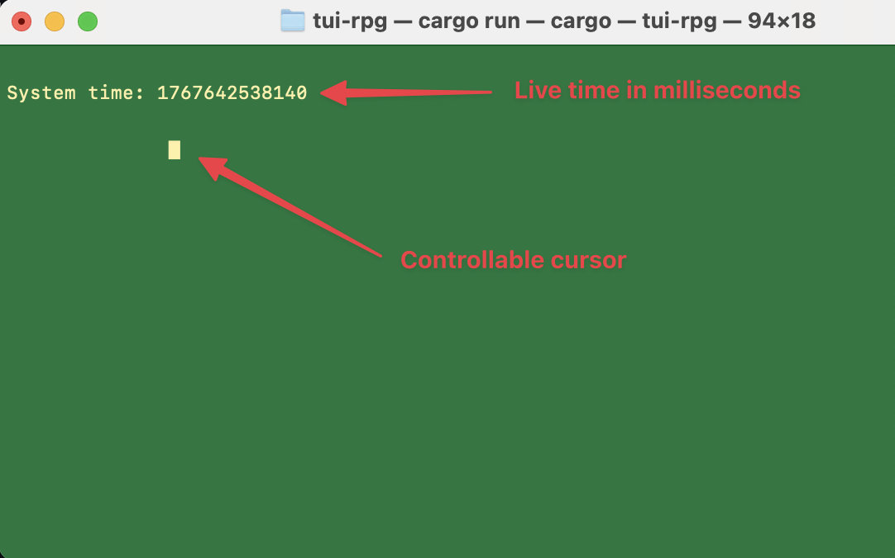
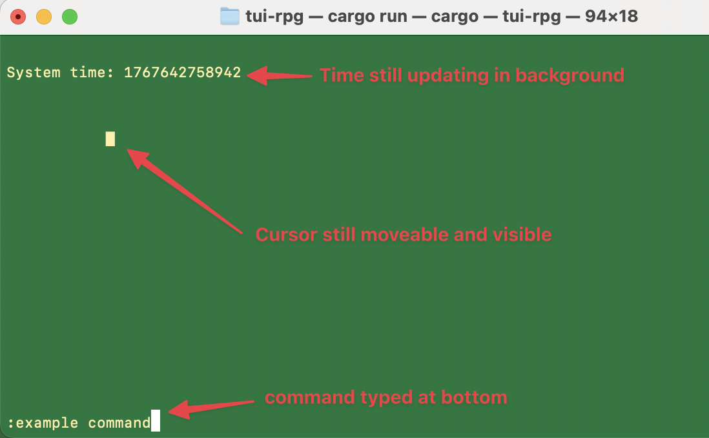

# Cursor Movement

A TUI that outputs the system time in milliseconds to the terminal's alternate screen in raw mode. The screen is cleared and redrawn every 16ms. Using the arrow keys will move a cursor around the screen. Attempting to move the cursor off the screen will cause the cursor to wrap around to the other side of the terminal window.

The program also includes a command mode that can be entered by pressing `:`. User's can enter a command at the bottom of the screen. Pressing `Enter` will invoke a command handler and pressing `Escape` will clear the command buffer and exit command mode. 





### Quitting the program
Normal signals like `ctrl-c` will not interupt the program because the terminal is in raw mode. To quit press `q` or enter the `:q` command.

### Use cases
This program could be used as the basis for a RPG game where the cursor is the player. The same game loop could also be used in a text editor.

## Dependencies
The program uses `ncurses` to handle common terminal commands such as listening to keyboard events, moving the cursor, and putting the terminal in raw mode.

## Installation
This project assumes that you have `git` and `cmake` already installed.
```
git clone git@github.com:ZebTheWizard/cpp-cursor-movement.git
cd cpp-cursor-movement/build
cmake ..
make && ./main
```
